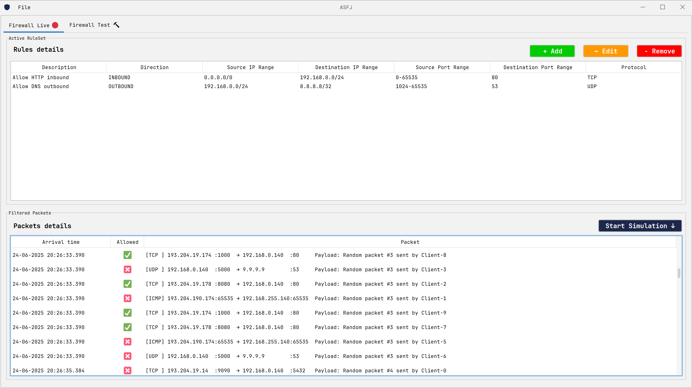

# A Simple Firewall in Java

<u>**A Simple Firewall in Java (ASFJ)**</u> è un progetto sviluppato per la prova finale del corso di "Tecniche Avanzata di Programmazione", edizione 2024-2025, Università degli Studi della Basilicata, laurea magistrale in Ingegneria informatica e delle tecnologie dell'informazione.


### 🛡️ Introduzione

**A Simple Firewall in Java (ASFJ)** è un'applicazione Java desktop modulare che simula il comportamento di un firewall software. Il progetto permette di testare, monitorare e modificare dinamicamente regole di filtraggio su pacchetti generati da client concorrenti. L'interfaccia utente, costruita con Swing, consente un'interazione in tempo reale con il traffico e le regole, supportando anche la simulazione di ambienti di rete controllati per fini didattici o sperimentali.

ASFJ è stato sviluppato con un'attenzione particolare alla separazione dei moduli, all'estensibilità e all'applicabilità di principi avanzati di ingegneria del software, come inversione del controllo (tramite Guice), e personalizzazione del comportamento applicativo tramite file `properties`.


### 🧰 Toolchain Utilizzata

ASFJ si basa su una toolchain moderna e professionale:

- **Java 21**: linguaggio principale
- **Gradle (Kotlin DSL)**: sistema di build e gestione delle dipendenze
- **Gradle Shadow Plugin**: per la generazione di un *fat jar* eseguibile (`ASFJ-1.0.0.jar`)
- **Guice**: dependency injection per gestione flessibile dei componenti e Aspect-oriented programming
- **Gson**: serializzazione e deserializzazione delle regole in formato JSON

Il progetto è completamente cross-platform e può essere eseguito su qualsiasi sistema con una JRE 17+ disponibile.


### 🚀 Avvio dell'Applicazione

ASFJ è distribuito come **fat jar**, quindi una volta scompattato il file ```.tar``` disponibile nella sotto-cartella ```/bin``` del progetto, è eseguibile direttamente da terminale con il seguente comando:

```bash
java "-DLOG_LEVEL=INFO" "-Dfirewallgui.application.guice.stage=production" -jar ./ASFJ-1.0.0.jar
```

Per comodità, sono forniti due script di avvio già pronti:

- ```ASFJ_start.ps1``` → Per sistemi Windows
- ```ASFJ_start.sh``` → Per sistemi Unix-like

Entrambi i file eseguono il jar con le opportune proprietà di sistema già configurate.


### 🏛️ Architettura del progetto

Il progetto è stato strutturato in modo modulare per favorire la manutenibilità, la testabilità e la riusabilità del codice. Sono stati definiti quattro sottoprogetti principali, organizzati secondo i principi di sviluppo delle moderne architettura software come separazione delle responsabilità, inversione del controllo e isolamento dei componenti:

1) **firewall-api**: contiene le interfacce condivise tra i moduli, come IFirewallFacade, IRuleSet, IRule, IPacket ecc. Questo modulo rappresenta il contratto che lega insieme gli altri componenti e consente un disaccoppiamento chiaro tra implementazioni e dipendenze.

2) **firewall-core**: implementa la logica centrale del firewall, compresi il controllo dei pacchetti, la gestione dei set di regole(caricamento da file, test su varianti del set), la gestione delle regole di filtraggio(aggiunta, modifica e rimozione). È progettato per essere indipendente dall'interfaccia utente, rendendolo facilmente testabile e riutilizzabile in diversi contesti (es. interfacce grafiche alternative, servizi web, test automatici).

3) **firewall-gui**: fornisce l'interfaccia grafica Desktop Swing per l’interazione con il firewall. Si appoggia unicamente alle interfacce definite in firewall-api per interagire con la logica sottostante, ed è conforme con l’architettura Model-View-Controller(MVC). La GUI si divide in due tab: la prima tab chiamata "Firewall Live" e la seconda tab chiamata "Firewall Test". Nella prima tab risulta possibile controllare l'attuale set di regole attivo ovvero il set di regole effettivamente utilizzato dal firewall per filtrare i pacchetti e modificarlo(aggiunta regola, modifica regola e rimozione regola); risulta inoltre possibile iniziare una simulazione e consultare i pacchetti in transito e filtrati dal firewall con il relativo tempo di arrivo, stato di filtraggio(accettato, rifiutato) e payload. Nella seconda tab risulta possibile effetture tutte le operazioni sopra descritte sulle regole ma su un set di test, che quindi non impatta il funzionamento del firewall, a tale scopo di test è possibile creare a proprio piacimento un pacchetto di test da far filitrare al set di test.

4) **client-simulator**: simula il comportamento di client multipli che inviano pacchetti concorrenti verso il firewall. È progettato come modulo autonomo, senza dipendenza dalla GUI, e interagisce solo tramite le interfacce comuni. Fornisce log dettagliati delle attività processate e simulate.

Questa organizzazione modulare riflette un approccio scalabile e professionale, facilitando la sostituzione o l’estensione di ciascun componente (es. nuova GUI, core alternativo, nuovi test automatizzati) grazie al basso accoppiamento, mantenendo al contempo un forte isolamento tra le responsabilità grazie alla alta coesione.


### ⚙️ Modalità di Funzionamento del Firewall

Il progetto prevede che i pacchetti generati dai client vengano analizzati dal firewall attraverso un meccanismo semplificato ma efficace, basato sull’invocazione esplicita e diretta del metodo ```activeRuleSetProcessPacket()``` da parte di ciascun client, ovvero tramite **chiamata di metodo diretta**.

In fase di progettazione, è stato valutato anche un meccanismo più realistico, in cui i client avrebbero inviato pacchetti tramite socket al firewall, che li avrebbe ricevuti in modo asincrono, ovvero tramite **comunicazione via rete**. Tuttavia, questa soluzione avrebbe introdotto complessità tecniche legate alla gestione della concorrenza sulle connessioni di rete, alla serializzazione dei pacchetti e alla necessità di un ciclo di ricezione attiva (socket polling) da parte del firewall.

Per rendere il progetto più chiaro e focalizzato sugli aspetti centrali (filtraggio, regole, sincronizzazione tra thread e AOP), si è deciso di optare per la prima soluzione, in cui ogni client(thread), simulando l’invio del pacchetto, chiama direttamente ```firewall.activeRuleSetProcessPacket(packet)```. Questo approccio consente di simulare efficacemente il flusso dei pacchetti verso il firewall, mantenendo il controllo sulla concorrenza e semplificando il tracciamento e la verifica dell’intero sistema.

Questa decisione preserva l’obiettivo didattico di simulare un ambiente concorrente e reattivo, mantenendo il codice più leggibile, manutenibile e testabile. Inoltre, grazie all’estensivo utilizzo delle interfacce, è possibile sviluppare anche la logica alternativa basata sulla comunicazione via rete e con costi minimi è possibile sostituirla all’implementazione attuale.

Per informazioni aggiuntive sul funzionamento dell'applicazione fare riferimento alla documentazione disponibile nella sotto-cartella ```/doc``` del progetto, oppure ai commenti del codice sorgente.


### 🖼️ Galleria

Tab Firewall Live                                            |  Tab Firewall Test
:-----------------------------------------------------------:|:------------------------------------------------------------:
  |  


### 📄 Licenza

Questo progetto è concesso in uso con la licenza MIT, vedere [LICENSE.txt](./LICENSE.txt) per ulteriori informazioni.