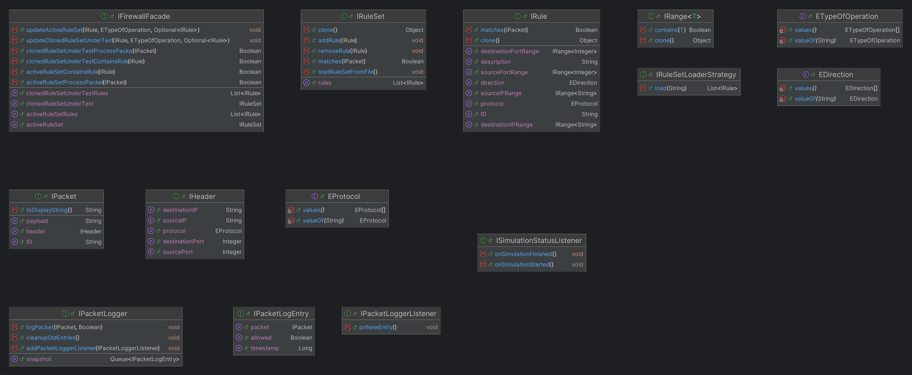
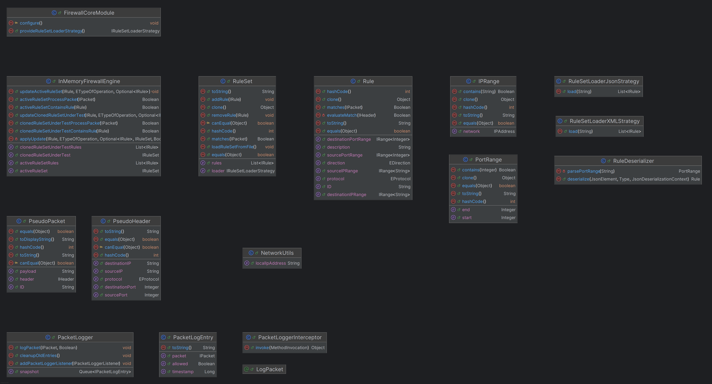
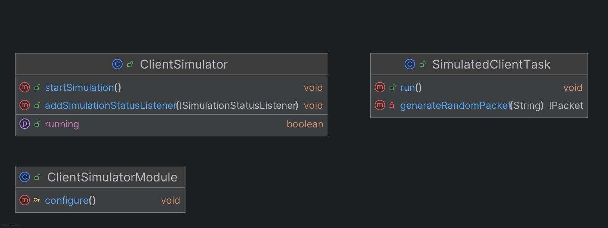

## Documentazione di ASFJ

### 1. Modellazione UML della soluzione progettata

ASFJ è strutturata in quattro moduli(corrispondenti a quattro sotto-progetti gradle):

1) **firewall-api**
2) **firewall-core**
3) **firewall-gui**
4) **client-simulator**

Il modulo **firewall-api** contiene le interfacce condivise tra i moduli, come IFirewallFacade, IRuleSet, IRule, IPacket ecc. Questo modulo rappresenta il contratto che lega insieme gli altri componenti e consente un disaccoppiamento chiaro tra implementazioni e dipendenze. Il suo class_diagram è il seguente:



È interessante notare come sia stato adottato il Design Pattern Facade, qui infatti IFirewallFacade rappresenta una interfaccia semplificata che permette in maniera semplice di ottenere la maggioranza delle risorse e di performare la maggioranza delle operazioni del firewall. Le restanti interfacce rappresentano tutti gli oggetti del dominio applicativo e il loro contratto in modo che i vari moduli dipendano solo da firewall-api, questo permette in maniera semplificata in futuro di cambiare il core per passare a una versione con socket-polling oppure di sostituire la gui per passare a una versione con JavaFX.

Il modulo **firewall-core** implementa la logica centrale del firewall, compresi il controllo dei pacchetti, la gestione dei set di regole(caricamento da file, test su varianti del set), la gestione delle regole di filtraggio(aggiunta, modifica e rimozione). Il suo class_diagram è il seguente:



Concettualmente, il core si divide in: Model (regole, pacchetti, range); Service (engine di filtraggio e logger); Util (parser JSON/Properties, network utils).

Il modulo **firewall-gui** fornisce l'interfaccia grafica Desktop Swing per l’interazione con il firewall. Si appoggia unicamente alle interfacce definite in firewall-api per interagire con la logica sottostante, ed è conforme con l’architettura Model-View-Controller(MVC). Il suo class_diagram è il seguente:


Concettualmente, la gui si divide in: Model ovvero RulesDetailsTableModel, PacketsDetailsTableModel (singleton o annotati con @Named per contesti diversi); View ovvero MainFrame, MainPanel, RuleFormDialog; Controller ovvero MainPanelController, RuleFormDialogController che gestiscono eventi utente e aggiornano il model.

Il modulo **client-simulator** simula il comportamento di client multipli che inviano pacchetti concorrenti verso il firewall. Il suo class_diagram è il seguente:



---

### 2. Realizzazione della Dependency Injection

**Framework**: Google Guice 7.0.0.

- **Modules**:
  - `FirewallCoreModule`: bind di `IFirewallFacade` su `InMemoryFirewallEngine`, `IRuleSet` su `RuleSet`,  `IPacketLogger` su `PacketLogger`;
  - `FirewallGUIModule`: bind dei table models, con annotazioni (`@Named("active")`, `@Named("cloned")`) in modo da permettere l'iniezione di due singleton dello stesso tipo.

**Esempio**:
```java
bind(IFirewallFacade.class)
    .to(InMemoryFirewallEngine.class)
    .in(Singleton.class);

bind(RulesDetailsTableModel.class)
    .annotatedWith(Names.named("active"))
    .to(RulesDetailsTableModel.class)
    .in(Singleton.class);
```

L'`Injector` viene creato in `Application` e fornisce tutte le dipendenze ai componenti dei vari moduli.

---

### 3. Implementazione dell'Aspect

**Framework**: Guice AOP + AOP Alliance.

- **Annotazione Custom**: `@LogPacket`
- **Interceptor**: `PacketLoggerInterceptor implements MethodInterceptor`:
  - intercetta ogni chiamata a `activeRuleSetProcessPacket(IPacket)`
  - registra `PacketLogEntry` in `PacketLogger`.

**Configurazione** in `FirewallModule`:
```java
PacketLoggerInterceptor interceptor = new PacketLoggerInterceptor();
requestInjection(interceptor);
bindInterceptor(Matchers.any(), Matchers.annotatedWith(LogPacket.class), interceptor);
```

L'aspect è totalmente trasversale e non richiede modifiche al codice core. Se si desidera loggare un qualsiasi altro metodo relativo al processamento dei pacchetti come ad esempio `clonedRuleSetUnderTestProcessPacket` basta annotarlo con `@LogPacket` come detto in precedenza. 

---

### 4. Gestione dei Thread e Sincronizzazione

**ClientSimulator**:
Grazie alla classe **ScheduledExecutorService** ogni client invia pacchetti in loop chiamando il metodo `scheduleAtFixedRate()`.

**InMemoryFirewallEngine**:
- **ReadWriteLock** per proteggere l'accesso concorrente al `activeRuleSet` e al `clonedRulSet`;
- `activeRuleSetProcessPacket()` acquisisce `readLock()`, `updateActiveRuleSet()` acquisisce ad esempio `writeLock()`

**Coordinamento**:
- `CountDownLatch` per attendere la fine dei client in simulazioni test;
- `ConcurrentLinkedQueue` in `PacketLogger` per il log thread-safe.

---

### 5. Clonazione

**Interfaccia**: `IRuleSet implements Cloneable` e `IRule implements Cloneable`.

**Implementazione**:
```java
@Override
public Object clone() {
    RuleSet clone = (RuleSet) super.clone();
    clone.rules = new ArrayList<>();
    for (IRule r : this.rules) {
        clone.rules.add((IRule) r.clone());
    }
    return clone;
}
```
Ogni `Rule` clona i suoi campi primitivi compresi gli IPRange e PortRange, che a loro volta clonano oggetti non-clonabili ricreandoli via costruttore.  
Il risultato è uno snapshot isolato del set di regole, modificabile in GUI senza influenzare l'`activeRuleSet`. Ovvero viene creato il `clonedRuleSet` che altro non è che una deep copy dell'`activeRuleSet`.

